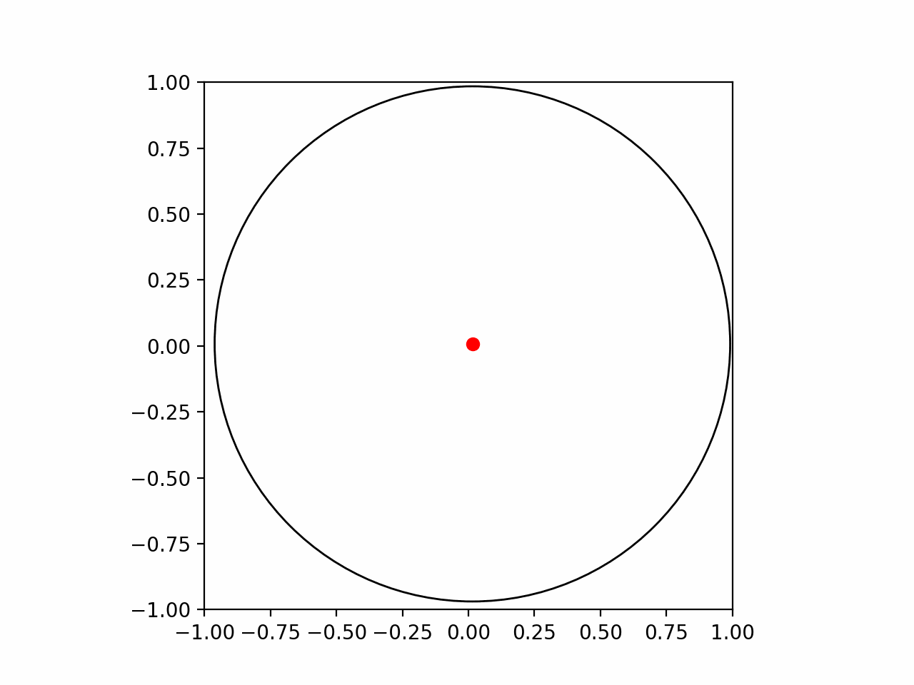
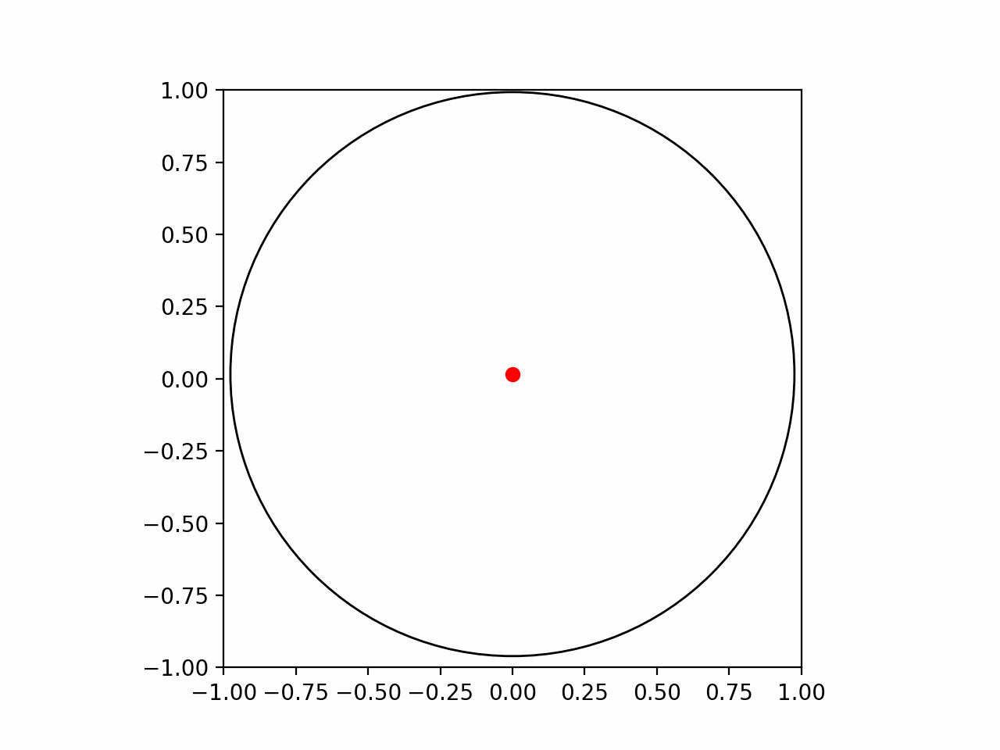

# shrinkcircle

[](https://www.python.org)


This package implementing an algorithm where there is a unit circle, and the circle contracts towards a point within the circle.



## Install it from PyPI

```bash
pip install project_name
```

## Usage
WIP

## Advanced Usage
WIP